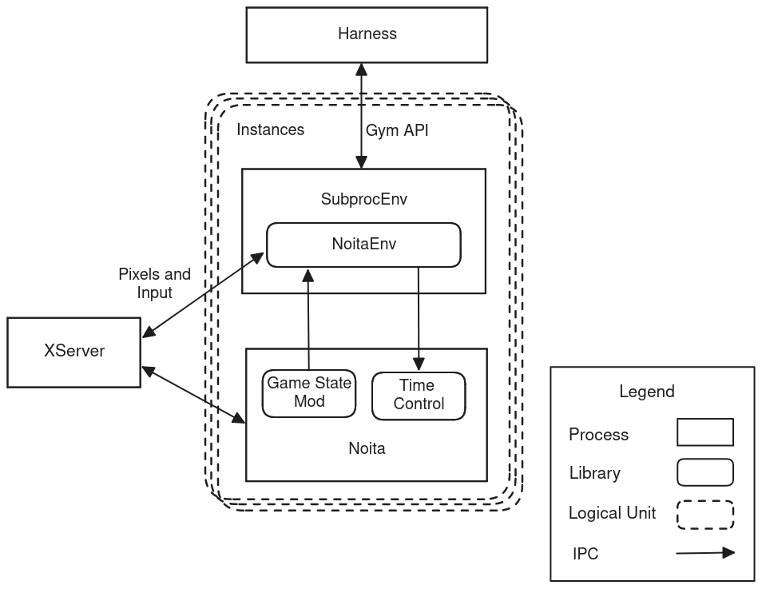

# BounceRL

BounceRL is a framework for turning X11 applications into environments for general 
purpose digital agents. The project aims to be useful for hobbyists and researchers 
alike.

The core framework connects to target apps to provide:
- App Orchestration
- Screen Capture 
- Keyboard and Mouse Input

These are sufficient for state-free and reward-free environments. However, we can also
use this framework to implement environments that export state and rewards. We do this
by writing an app specific plugin or mod that exports the app's state, and then writing
a Gym environment with the app's state and the Bounce framework.

We have a Noita Gym environment available now and hope to have more environments soon.
TODO: Add docs on how to get up and running with the Noita environment.

## Performance Notes

The framework includes a couple of neat tricks to significantly increase performance
and to provide a pseudo-synchronous environment from an otherwise unsynchronized
target app.

1. We implement a fake multiseat setup using Multi-pointer X and some X11 protocol
traffic interception. This enables running several hardware accelerated apps on a single
GPU which is otherwise unsupported by Nvidia without additional paid licenses.

2. We implement a time control library, similar to libfaketime, that allows Bounce
to control the target app's rate of time progression, accelerating the app to faster
than realtime while stepping the environment and slowing it to near paused when waiting
for the next step.

## System Diagram

